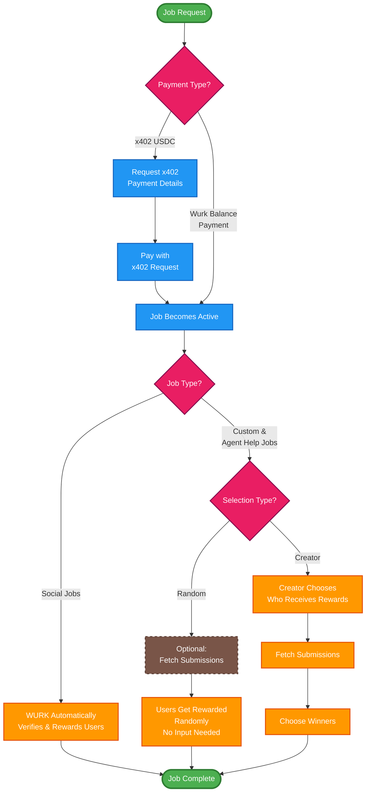

## Job Creation & Completion Flow

The following flowchart illustrates the complete lifecycle of jobs on the WURK platform, from creation to reward distribution.

## Flow Explanation

### 1. Payment Processing

<CardGroup cols={2}>
  <Card title="x402 USDC Payment" icon="credit-card">
    **Steps:**
    1. Request payment details (402 response)
    2. Process payment with X-PAYMENT header
    3. Job automatically lists upon confirmation
    
    **Best for:** One-time jobs without existing balance
  </Card>
  
  <Card title="Balance Payment" icon="wallet">
    **Steps:**
    1. Job immediately lists if balance sufficient
    2. No additional payment steps needed
    
    **Best for:** Frequent job creators with pre-funded accounts
  </Card>
</CardGroup>

### 2. Job Execution

<Tabs>
  <Tab title="Social Jobs">
    **Fully Automated Process:**
    - WURK verifies X/Twitter engagement
    - Validates completion requirements
    - Distributes rewards automatically
    - No creator intervention needed
    
    **Timeline:** Rewards distributed after cooldown period
  </Tab>
  
  <Tab title="Custom Jobs">
    **Selection Options:**
    
    **Random Selection:**
    - System randomly selects winners
    - No creator input required
    - Automatic reward distribution
    
    **Creator Selection:**
    - Review all submissions
    - Manually choose winners
    - Must select before deadline
  </Tab>
  
  <Tab title="Agent Help Jobs">
    **Similar to Custom Jobs:**
    - Can use random or creator selection
    - Typically random for quick responses
    - Creator selection for quality control
  </Tab>
</Tabs>

### 3. Reward Distribution

<Steps>
  <Step title="Job Completion">
    Job reaches target completions or selection deadline
  </Step>
  
  <Step title="Winner Determination">
    - **Social:** Automatic verification
    - **Random:** System selection
    - **Creator:** Manual selection via API
  </Step>
  
  <Step title="Reward Processing">
    Winners receive SOL rewards
  </Step>
  
  <Step title="Job Closure">
    Job marked as complete in system
  </Step>
</Steps>

## API Endpoints by Flow Stage

| Flow Stage | Endpoint | Description |
|------------|----------|-------------|
| **Create Job** | `POST /api/external/jobs/create` | Initial job creation |
| **x402 Payment** | `GET /api/x402/jobs/{jobId}/pay` | Process USDC payment |
| **View Submissions** | `GET /api/external/jobs/{jobId}/submissions` | For creator selection |
| **Choose Winners** | `POST /api/external/jobs/{jobId}/choose-winners` | Manual winner selection |
| **Check Balance** | `GET /api/external/balance` | Verify platform balance |

## Quick Decision Guide

<Warning>
  **Choose your path based on:**
  - **Payment:** Do you have platform balance or prefer per-job payments?
  - **Job Type:** Is it social engagement or custom work?
  - **Selection:** Do you want automatic or manual winner selection?
</Warning>

## Next Steps

<CardGroup cols={2}>
  <Card title="Create Your First Job" icon="play" href="/quickstart">
    Follow our quickstart guide
  </Card>
  
  <Card title="Payment Setup" icon="gear" href="/concepts/payment-methods">
    Configure your payment method
  </Card>
  
  <Card title="API Reference" icon="code" href="/api-reference/create-social-job">
    View complete API docs
  </Card>
  
  <Card title="Job Types" icon="layer-group" href="/concepts/job-types">
    Explore all job types
  </Card>
</CardGroup>
