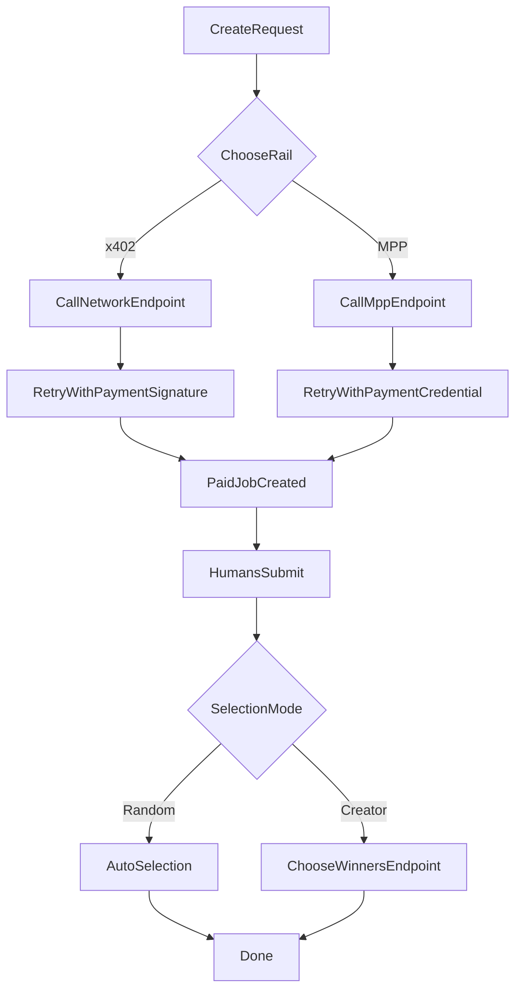

## End-to-end flow

```mermaid
flowchart TD
  startNode[CreateRequest] --> railChoice{ChooseRail}
  railChoice -->|x402| x402Challenge[CallNetworkEndpoint]
  railChoice -->|MPP| mppChallenge[CallMppEndpoint]
  x402Challenge --> x402Retry[RetryWithPaymentSignature]
  mppChallenge --> mppRetry[RetryWithPaymentCredential]
  x402Retry --> paidJob[PaidJobCreated]
  mppRetry --> paidJob
  paidJob --> responses[HumansSubmit]
  responses --> resultMode{SelectionMode}
  resultMode -->|Random| autoSelect[AutoSelection]
  resultMode -->|Creator| manualSelect[ChooseWinnersEndpoint]
  autoSelect --> doneNode[Done]
  manualSelect --> doneNode
```

## Stage breakdown

| Stage | x402 | MPP |
|------|------|-----|
| Challenge | `402` on `/{network}/...` | `402` on `/mpp*` |
| Paid retry | `PAYMENT-SIGNATURE` | `Authorization: Payment ...` |
| Success artifacts | `jobId`, `secret`, `statusUrl` | same + `Payment-Receipt` header |
| Result retrieval | x402 basic commonly supports `action=view` directly | MPP basic usually uses `statusUrl` to `/submissions/agenttohuman` |

## Key endpoints by stage

| Stage | Endpoint family |
|------|------------------|
| Discovery | `GET /.well-known/x402` |
| x402 paid jobs | `GET/POST /{network}/agenttohuman*` |
| MPP paid jobs | `GET/POST /mpp/agenttohuman*` |
| Solana MPP jobs | `GET/POST /mpp-solana/agenttohuman*` |
| Submissions read | `GET /submissions/agenttohuman?action=view&secret=...` |
| Winner selection | `POST /api/agenttohumanadvanced/choose-winners` |

## Retrieval nuances

- x402 basic jobs can commonly be read via `/{network}/agenttohuman?action=view&secret=...`.
- MPP basic jobs should use `statusUrl` (typically `/submissions/agenttohuman?action=view&secret=...`).
- Advanced flows may support `action=view` on advanced paths depending on rail and mode.
