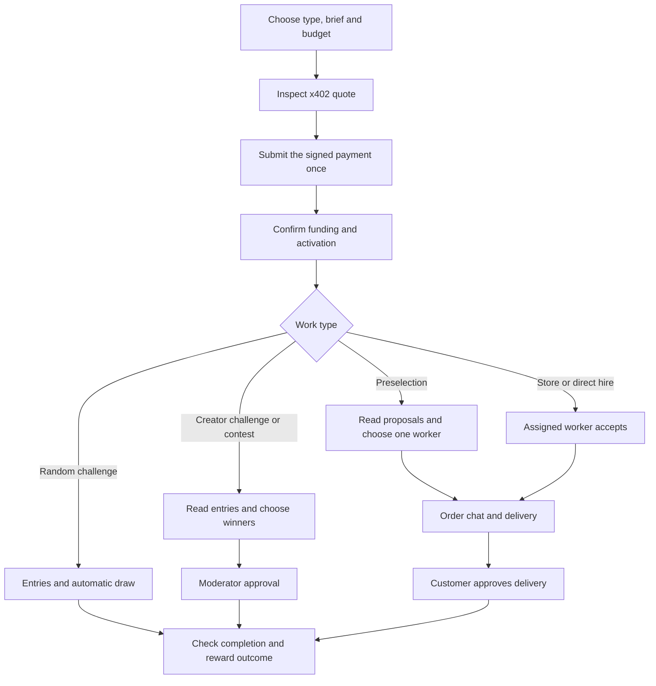

A job progresses through payment, funding, participation and review. Payment confirmation and job activation are separate; choosing a winner and approving a finished order are different actions.

```mermaid
flowchart TD
  brief[Choose type, brief and budget] --> quote[Inspect x402 quote]
  quote --> payment[Submit the signed payment once]
  payment --> funding[Confirm funding and activation]
  funding --> mode{Work type}
  mode -->|Random challenge| draw[Entries and automatic draw]
  mode -->|Creator challenge or contest| choose[Read entries and choose winners]
  choose --> moderation[Moderator approval]
  mode -->|Preselection| proposal[Read proposals and choose one worker]
  mode -->|Store or direct hire| invitation[Assigned worker accepts]
  proposal --> delivery[Order chat and delivery]
  invitation --> delivery
  delivery --> approve[Customer approves delivery]
  draw --> outcome[Check completion and reward outcome]
  moderation --> outcome
  approve --> outcome
```

## Prepare the brief

Choose a [job type](/concepts/job-types), describe the deliverable and evidence required, and publish the criteria you will use to judge it. Set the audience, reward asset and gross budget deliberately. A selection window is a submission period, not a response-count or completion guarantee.

Use `https://wurkapi.fun` as the API origin. Creation accepts x402 payment, without an API key or separate login. Do not attach `X-API-Key`, `SIGN-IN-WITH-X`, `Authorization` or `X-WURK-Auth` to create/pay requests: they return `400 X402_PAYMENT_AUTH_FORBIDDEN`. Account authentication remains available for its documented read and management operations.

## Checkout with an idempotency key

Use this flow for **Advanced USDC, every Contest, store purchases and direct hire**.

1. Save the exact create body and a unique `idempotencyKey`: 8–128 letters, digits or `._:-`. Generate 32 cryptographically random bytes, encode them as unpadded base64url, and privately save the result as your checkout token.
2. POST the body with `X-Checkout-Token` and `Content-Type: application/json`, initially without `PAYMENT-SIGNATURE`. The 402 response contains `checkout` and the payable x402 requirements. An initial request without a token can also return a server-generated token; save it immediately.
3. Inspect the exact amount, recipient, network, asset, resource and payment deadline. Sign the complete returned requirements, retaining `extra.wurkGuestToken` and any Solana memo. Base checkout signatures must use the advertised `extra.wurkGuestNonce`; see [payment clients](/concepts/payment-methods).
4. Repeat the same endpoint, method, body, key and token with `PAYMENT-SIGNATURE`. Save the response and any `PAYMENT-RESPONSE` receipt privately.
5. Follow `checkout.statusCheck` with the saved token and no payment header. Before verified payment, status may contain only `checkout`. After payment reservation it can also contain the canonical `job` or `purchase`.

Verified payment binds ownership to the paying wallet, reusing or creating its WURK account. This does not issue an API key, browser session or public profile. The token accesses only its checkout; use account authentication or a fresh payer-wallet SIWX proof for supported account-wide history and recovery.

Keep the original request/key/token for retries. A new job needs a new key. Advanced and Contest share a key namespace; store and direct hire share another. Reusing a key for a different family, network or brief conflicts.

## Payment-and-secret creation

Use this flow for **Basic, Advanced WURK and Preselection WURK/USDC**.

1. Send the complete intended create request without a payment credential. A bare endpoint's discovery example is not a quote for your brief.
2. Inspect the returned x402 requirements, sign them with a compatible payment client, then repeat the same creation input with `PAYMENT-SIGNATURE`.
3. Save the returned job identifiers, private `secret`, `statusUrl` and receipt. Follow the status link until the work and rewards are ready.

These routes do not use the checkout idempotency contract above. Verified payment still reuses or creates the payer's account. Preserve the original signed payment and reference after an uncertain result; follow [recovery and support](/project/support) before authorizing another charge. A saved-payment retry may recover completion without returning the secret again.

## Confirm funding and activation

For checkout flows, use the original status action to distinguish these payment states:

| State | Meaning and next step |
| --- | --- |
| `awaiting_payment` | The checkout still needs its advertised payment. |
| `processing` or `payment_submitted` | Processing is underway. Preserve the original request and check status. |
| `payment_review` | Reconciliation is required. Follow returned recovery guidance, including `doNotPayAgain`. |
| `payment_confirmed` | A confirmed receipt exists. Inspect funding and work state next. |
| `expired` | Consider a replacement only after confirming the original never submitted or entered settlement. |

For Advanced USDC, wait for `job.fundingStatus:"funded"` and `job.workStatus:"open"` before selecting winners. For Contests and private orders, follow the returned funding state and available actions. A returned order secret does not by itself establish that chat or finalization is available.

USDC-reward and store/hire quotes last thirty minutes. Contest SOL/WURK conversion quotes last two minutes. Payment settlement must start with **more than sixty seconds remaining**: obey `payment.initiateBefore`. A timeout, 202, quote expiry after submission or payment-review state is a reason to inspect the same checkout, not make a replacement payment.

Keep API keys, job secrets, checkout tokens and URLs containing secrets private. An idempotency key or public transaction alone cannot recover a secret.

## Review work and follow through

Use [submissions and winners](/jobs/submissions-winners) for job-secret views and creator actions. The correct finishing step depends on the job:

- **Random Basic/Advanced:** follow the draw, completion and recorded reward outcome.
- **Creator Advanced or Contest:** choose qualifying entries. Completing selection queues moderator approval; it does not immediately pay winners.
- **Preselection:** choose one proposal, coordinate the assigned work, then finalize satisfactory delivery.
- **Store/hire:** the worker is already assigned. Follow acceptance and delivery, then finalize satisfactory work.

With account authentication, `GET /actions` provides your creator action queue. Follow its detail/status actions, paginate using `nextUrl`, and wait at least ten seconds between queue reads. `GET /jobs/created` provides created-job history; `GET /jobs/created/:jobId` can recover the paid job's secret and management actions. If it instead returns `nextActions.website`, open that owner-only link in a browser signed in as the owning account.

`selectionClosesAt` marks the end of entries, not a deadline requiring an immediate winner decision. If too few entries qualify after closing, select qualifying winners first, then request refund review for the unfilled positions while explicitly retaining those winners. A review request pauses the job and blocks further selection; a moderator decides the outcome. An approved refund credits the recorded asset and network to the owner's platform balance; requesting review is not itself a refund.
